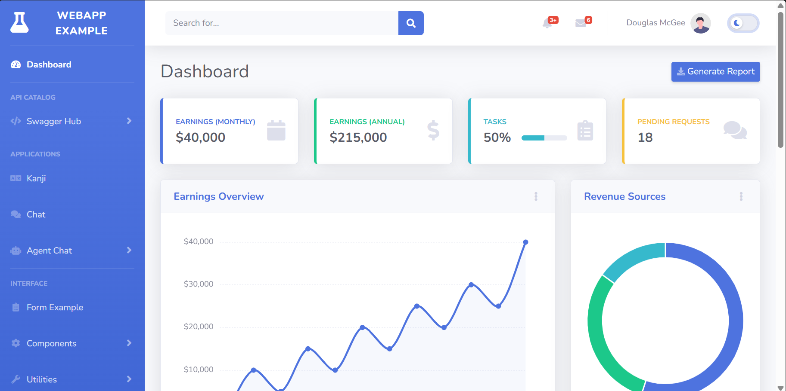
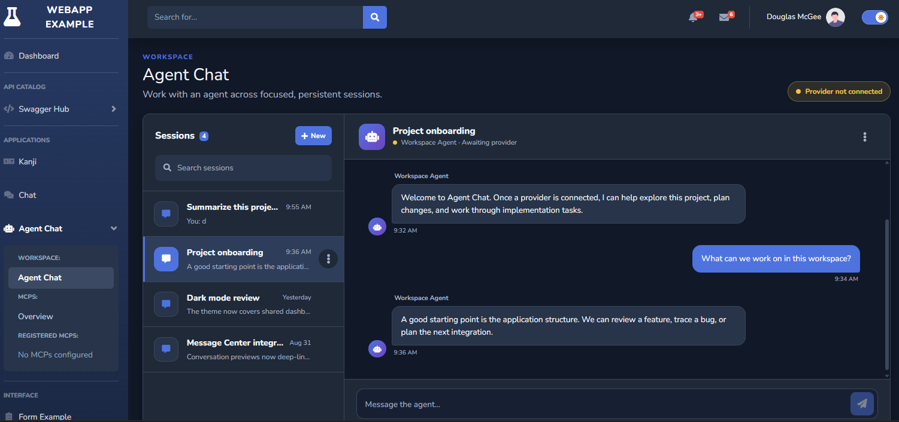
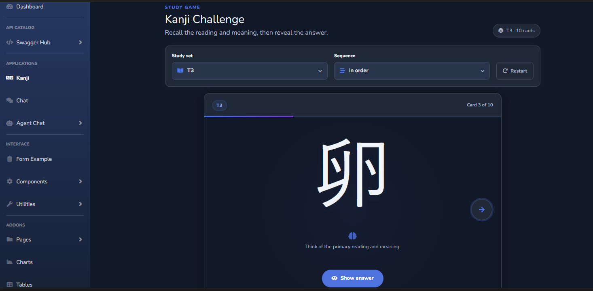

# WebApp Example

**A polished Flask showcase for dashboards, agent experiences, API discovery, and interactive workflows.**

WebApp Example turns a classic admin template into a modern reference application.
It brings together responsive UI patterns, AI-ready extension points, practical
frontend demos, and a consistent light/dark experience in one approachable codebase.

<p align="center">
  <picture>
    <source media="(prefers-color-scheme: dark)" srcset="./docs/img/app-home-dark.png">
    <source media="(prefers-color-scheme: light)" srcset="./docs/img/app-home-light.png">
    
  </picture>
</p>

## One project, multiple product patterns

- **Agent-ready workspace** - persistent chat sessions, provider integration, and MCP patterns.
- **API catalog** - searchable Swagger services with metadata, detail pages, and documentation links.
- **Interactive applications** - database-backed subscription tracking, Kanji study, chat, forms, and charts.
- **Theme-aware interface** - responsive light and dark modes across shared components.
- **Flask-first structure** - application factory, focused blueprints, Jinja templates, and static assets.

<table>
  <tr>
    <td width="50%">
      
    </td>
    <td width="50%">
      
    </td>
  </tr>
  <tr>
    <td align="center">
      <strong>Agent</strong><br>
      Chat and Companion workspaces with clear provider and MCP extension points.
    </td>
    <td align="center">
      <strong>Kanji Challenge</strong><br>
      A focused study experience with levels, reveal controls, and random rounds.
    </td>
  </tr>
</table>

## Explore the showcase

| Experience | Route | Highlight |
| --- | --- | --- |
| Dashboard | `/` | Cards, charts, navigation, and theme switching |
| Agent / Chat | `/agent/` | Persistent sessions and pluggable agent provider |
| Agent / Companion | `/agent/companion/` | Portrait, voice placeholder, and shared agent chat |
| MCP Overview | `/agent/mcps/` | Example servers, tools, transports, and runtime registry |
| Swagger Hub | `/swagger/` | Searchable, configuration-driven API catalog |
| Kanji Challenge | `/kanji/` | Ordered and no-repeat random study rounds |
| Subscription Management | `/subscriptions/` | Persisted recurring costs and normalized summaries |
| Form Example | `/form/` | Calendar, validation, and drag-and-drop files |
| Charts | `/others/charts` | Area, bar, donut, and radar/spider examples |

## Run locally

```powershell
Copy-Item .env.example .env
python -m pip install -r requirements.txt
python main.py
```

Open **http://127.0.0.1:8081**.

For virtual environments, Docker, configuration, and troubleshooting, see the
[Getting Started guide](./docs/getting-started.md).

## Run the tests

```powershell
python -m unittest discover -s tests -v
```

The suite uses Python's standard library and covers routes, configuration,
subscription persistence, agent and MCP contracts, the Swagger catalog, and
Kanji data integrity.

## Automation

- **CI** tests pinned and latest Ubuntu, Windows 2022, and macOS 14 before validating the Linux image.
- **CD** gates on the same tests and publishes versioned images to GitHub Container Registry.
- **Dependabot** checks Python and GitHub Actions dependencies monthly.

See the [CI/CD guide](./docs/ci-cd.md) for triggers, image tags, and release steps.

## Documentation

- [Documentation home](./docs/README.md)
- [Getting started](./docs/getting-started.md)
- [Architecture](./docs/architecture.md)
- [Feature guide](./docs/features.md)
- [Agent, MCP, and Swagger integrations](./docs/integrations.md)
- [CI/CD](./docs/ci-cd.md)

> [!NOTE]
> This repository is a reference application. Agent providers, MCP clients, form
> submission, authentication, and live service health checks remain explicit
> integration points rather than simulated production behavior.

## Built with

Python 3.11, Flask, Flask-SQLAlchemy, Jinja, Bootstrap 4, Font Awesome, Chart.js, and the
[SB Admin 2](https://startbootstrap.com/theme/sb-admin-2) design system.

## License and credits

Released under the [MIT License](./LICENSE).

WebApp Example adapts SB Admin 2 by
[Start Bootstrap](https://startbootstrap.com/). The upstream theme is MIT
licensed, and its original copyright and license notices are retained.
